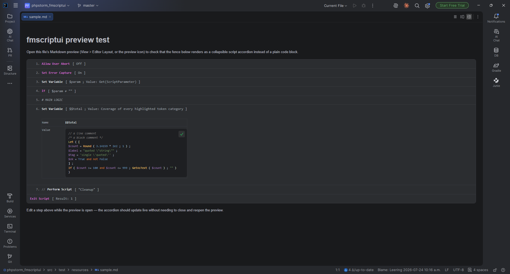

# fmscriptui-markdown

An IntelliJ Platform plugin that extends the built-in Markdown preview (the bundled
`org.intellij.plugins.markdown` plugin — present in PhpStorm, IntelliJ IDEA, WebStorm, etc.)
so that ` ```filemaker-script ` fenced code blocks render as collapsible, FileMaker-Pro-style
script accordions, using [fmscriptui](https://github.com/Blue-Kachina/fmscriptui).



## How it works

- `render.js`, `filemaker-highlight.js`, `filemaker-grammar.js` and `filemaker-script.css` are
  bundled verbatim from fmscriptui (`src/main/resources/web/`) — see `./gradlew updateFmscriptui`
  below to re-sync them. No third-party code is bundled: `filemaker-highlight.js` is
  fmscriptui's own small, dependency-free tokenizer, used as the calculation-syntax highlighter
  since this plugin never sets `window.hljs`.
- `FmScriptUiBrowserExtension` (Kotlin) registers with the Markdown plugin's
  `org.intellij.markdown.browserPreviewExtensionProvider` extension point to inject all of the
  above into the preview's JCEF browser.
- `filemaker-init.js` and `filemaker-script-dark.css` are the only plugin-authored files:
  - `render.js` is an ES module (`export function`), but the preview only injects scripts as
    plain classic `<script src>` tags. `filemaker-init.js` dynamically `import()`s it, then
    calls `renderFileMakerScripts()` on load and after every incremental DOM patch the preview
    applies (falling back to a `MutationObserver` if that hook isn't available). `render.js` in
    turn statically imports `filemaker-highlight.js` (which imports `filemaker-grammar.js`) to
    highlight embedded calculation blocks — all three ES modules are *also* listed in the
    extension's `scripts` (alongside the real classic script, `filemaker-init.js`) purely to
    get their URLs into the preview's CSP allowlist — an import of a URL that was never declared
    gets CSP-blocked, even though the URL is never executed as a classic script that way (it
    throws a harmless "Unexpected token" that's expected and ignored).
  - `filemaker-init.js` also detects the IDE's light/dark theme (no single stable signal exists
    across IDE versions, so it checks several fallbacks: `color-scheme` CSS, a `<meta
    name="color-scheme">` tag, common dark class names, and background-color brightness sampling)
    and toggles an `fm-dark` class on `<html>`, which `filemaker-script-dark.css` styles against.
    It re-checks on theme changes via `MutationObserver`/`matchMedia`.

## Known limitations

- Markdown-preview integration only — no standalone `.fmscript` file type/editor.

## Development

```bash
./gradlew runIde              # launches a sandboxed PhpStorm with the plugin installed
./gradlew updateFmscriptui    # re-downloads render.js / filemaker-highlight.js / filemaker-grammar.js / filemaker-script.css from GitHub
```

Open `src/test/resources/sample.md` in the sandboxed IDE and check its Markdown preview —
try toggling the IDE between a light and dark theme while it's open.

## License

fmscriptui-markdown is available under the MIT License. See [LICENSE](LICENSE).
