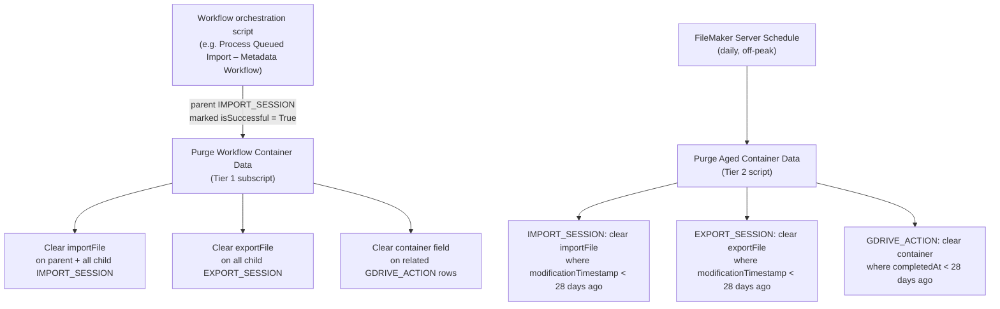

# Garbage Collection Plan — Container Data Cleanup

## Overview

NEXUS accumulates binary container data in three tables as files move through the
import/export pipeline:

- `IMPORT_SESSION::importFile` — the source file being imported.
- `EXPORT_SESSION::exportFile` — the file produced by an export.
- `GDRIVE_ACTION::fileContainer` — the file staged during a Google Drive
  download or upload

A file is frequently staged in `GDRIVE_ACTION` via download, then reused by
`IMPORT_SESSION` or `EXPORT_SESSION`, so the same bytes can exist in more than one
table at once while a workflow is running. Some of this already clears itself — a
child `IMPORT_SESSION` clears its own `importFile` right after a successful
import — but nothing clears `GDRIVE_ACTION`'s container, nothing clears
`EXPORT_SESSION::exportFile`, and nothing catches records that never reach a clean
success (crashed workflows, orphaned manual exports). Left alone, this is unbounded
container growth in the file.

This plan is a **two-tier** cleanup:

1. **Tier 1 — Purge on Workflow Success.** The moment a whole workflow (a parent
   `IMPORT_SESSION` and everything under it) is marked successful, immediately clear
   every container reachable from that workflow.
2. **Tier 2 — Scheduled 28-Day Sweep.** A daily FileMaker Server schedule that
   clears any container older than 28 days, regardless of how it got there. This is
   the backstop for standalone manual records, failed workflows, and anything Tier 1
   missed.



Both tiers only ever clear the **container field's contents** (`Set Field ... ; ""`).
Neither tier deletes records — the session rows stay in place as audit history; only
the binary payload goes away.

---

## Schema Recap

| Table            | Container field(s)       | Links back to a workflow via                                                                                                                                   |
|------------------|--------------------------|----------------------------------------------------------------------------------------------------------------------------------------------------------------|
| `IMPORT_SESSION` | `importFile` (Binary)    | `_kftParentImportSessionID` → parent `IMPORT_SESSION::__kptUUID` (empty on the parent itself)                                                                  |
| `EXPORT_SESSION` | `exportFile` (Binary)    | `_kftParentImportSessionID` → parent `IMPORT_SESSION::__kptUUID`                                                                                               |
| `GDRIVE_ACTION`  | `fileContainer` (Binary) | exactly one of `_kftImportSessionUUID` or `_kftExportSessionUUID` is populated per row, pointing at the `IMPORT_SESSION` or `EXPORT_SESSION` row it belongs to |

A workflow is only marked done (`IMPORT_SESSION::isSuccessful = True`,
`isRunning = False`) on its **parent** record after every child import, the final
export, and the final upload have all succeeded — so parent success implies the
whole chain succeeded. That's what Tier 1 hooks into.

---

## Tier 1 — Purge on Workflow Success

### Scope

This tier only fires for records that are part of a parent/child workflow chain
that just succeeded. Standalone records — exports or imports run manually from the
FileMaker UI with no parent workflow — are **not** touched by Tier 1. They rely
entirely on Tier 2's 28-day sweep.

`EXPORT_SESSION::exportFile` is cleared immediately on workflow success regardless
of the `isDownloaded` flag — Google Drive is treated as the durable copy once the
workflow's upload step succeeds.

### New subscript: `Purge Workflow Container Data`

Takes one script parameter: the parent `IMPORT_SESSION::__kptUUID` (plain text, not
JSON — this is an internal utility script, not an API entry point).

#### Build steps in FileMaker Pro

1. Open **Scripts → Script Workspace** (or press the Scripts menu → Manage Scripts).
2. Click the **New Script** button (the blank-page icon in the scripts list on the
   left), name it `Purge Workflow Container Data`.
3. With the new script open, add each step below by double-clicking it in the
   steps panel on the right, then filling in its options in the panel that appears
   under the script — the `→ Key: Value` lines in the fence below show exactly what
   to fill in for each step.
4. Use the **Specify Find Requests** dialog (opens automatically after adding an
   `Enter Find Mode` + editing the following request rows, or via **Perform
   Find/Replace → Specify**) wherever the fence shows multiple `New Record/Request`
   rows under one `Enter Find Mode` — each row becomes one row in that dialog,
   combined with OR.

```filemaker-script
1. Set Error Capture [ On ]

2. Set Variable [ $parentID ; Value: Get ( ScriptParameter ) ]
   → Name: $parentID
   → Value:
      Get ( ScriptParameter )

3. If [ IsEmpty ( $parentID ) ]
   → Condition:
      IsEmpty ( $parentID )

4. Exit Script [ Result: "Missing parentImportSessionID" ]
   → Result: "Missing parentImportSessionID"

5. End If

# (comment) [ Clear IMPORT_SESSION containers: parent + all children ]

6. Go to Layout [ IMPORT_SESSION ]
   → Layout: IMPORT_SESSION

7. Enter Find Mode [ Pause: Off ]
   → Pause: Off

8. Set Field [ IMPORT_SESSION::__kptUUID ; "==" & $parentID ]
   → Field: IMPORT_SESSION::__kptUUID
   → Value: "==" & $parentID

9. New Record/Request
   → (adds a second find-request row, combined with the first via OR)

10. Set Field [ IMPORT_SESSION::_kftParentImportSessionID ; "==" & $parentID ]
    → Field: IMPORT_SESSION::_kftParentImportSessionID
    → Value: "==" & $parentID

11. Perform Find []

12. Set Variable [ $importSessionIDs ; Value: "" ]
    → Name: $importSessionIDs
    → Value: ""

13. If [ Get ( FoundCount ) > 0 ]
    → Condition:
       Get ( FoundCount ) > 0

14. Go to Record/Request/Page [ First ]

15. Loop

16. Set Variable [ $importSessionIDs ; Value: List ( $importSessionIDs ; IMPORT_SESSION::__kptUUID ) ]
    → Name: $importSessionIDs
    → Value:
       List ( $importSessionIDs ; IMPORT_SESSION::__kptUUID )

17. Set Field [ IMPORT_SESSION::importFile ; "" ]
    → Field: IMPORT_SESSION::importFile
    → Value: ""

18. Go to Record/Request/Page [ Next ; Exit after last: On ]
    → Exit after last: On

19. End Loop

20. Commit Records/Requests [ With dialog: Off ]
    → With dialog: Off

21. End If

# (comment) [ Clear EXPORT_SESSION containers: all children of this workflow ]

22. Go to Layout [ EXPORT_SESSION ]
    → Layout: EXPORT_SESSION

23. Enter Find Mode [ Pause: Off ]
    → Pause: Off

24. Set Field [ EXPORT_SESSION::_kftParentImportSessionID ; "==" & $parentID ]
    → Field: EXPORT_SESSION::_kftParentImportSessionID
    → Value: "==" & $parentID

25. Perform Find []

26. Set Variable [ $exportSessionIDs ; Value: "" ]
    → Name: $exportSessionIDs
    → Value: ""

27. If [ Get ( FoundCount ) > 0 ]
    → Condition:
       Get ( FoundCount ) > 0

28. Go to Record/Request/Page [ First ]

29. Loop

30. Set Variable [ $exportSessionIDs ; Value: List ( $exportSessionIDs ; EXPORT_SESSION::__kptUUID ) ]
    → Name: $exportSessionIDs
    → Value:
       List ( $exportSessionIDs ; EXPORT_SESSION::__kptUUID )

31. Set Field [ EXPORT_SESSION::exportFile ; "" ]
    → Field: EXPORT_SESSION::exportFile
    → Value: ""

32. Go to Record/Request/Page [ Next ; Exit after last: On ]
    → Exit after last: On

33. End Loop

34. Commit Records/Requests [ With dialog: Off ]
    → With dialog: Off

35. End If

# (comment) [ Clear GDRIVE_ACTION containers: every row linked to the parent or any child ]

36. Set Variable [ $allSessionIDs ; Value: List ( $parentID ; $importSessionIDs ; $exportSessionIDs ) ]
    → Name: $allSessionIDs
    → Value:
       List ( $parentID ; $importSessionIDs ; $exportSessionIDs )

37. If [ not IsEmpty ( $allSessionIDs ) ]
    → Condition:
       not IsEmpty ( $allSessionIDs )

38. Go to Layout [ GDRIVE_ACTION ]
    → Layout: GDRIVE_ACTION

39. Enter Find Mode [ Pause: Off ]
    → Pause: Off

40. Set Variable [ $i ; Value: 1 ]
    → Name: $i
    → Value: 1

41. Loop

42. Exit Loop If [ $i > ValueCount ( $allSessionIDs ) ]
    → Condition:
       $i > ValueCount ( $allSessionIDs )

43. Set Field [ GDRIVE_ACTION::_kftImportSessionUUID ; "==" & GetValue ( $allSessionIDs ; $i ) ]
    → Field: GDRIVE_ACTION::_kftImportSessionUUID
    → Value:
       "==" & GetValue ( $allSessionIDs ; $i )

44. New Record/Request

45. Set Field [ GDRIVE_ACTION::_kftExportSessionUUID ; "==" & GetValue ( $allSessionIDs ; $i ) ]
    → Field: GDRIVE_ACTION::_kftExportSessionUUID
    → Value:
       "==" & GetValue ( $allSessionIDs ; $i )

46. Set Variable [ $i ; Value: $i + 1 ]
    → Name: $i
    → Value: $i + 1

47. If [ $i ≤ ValueCount ( $allSessionIDs ) ]
    → Condition:
       $i ≤ ValueCount ( $allSessionIDs )

48. New Record/Request

49. End If

50. End Loop

51. Set Error Capture [ On ]
    → (Perform Find below may legitimately find nothing — no GDRIVE_ACTION row
       for a given session ID is not an error)

52. Perform Find []

53. If [ Get ( FoundCount ) > 0 ]
    → Condition:
       Get ( FoundCount ) > 0

54. Go to Record/Request/Page [ First ]

55. Loop

56. Set Field [ GDRIVE_ACTION::fileContainer ; "" ]
    → Field: GDRIVE_ACTION::fileContainer
    → Value: ""
    → (substitute the confirmed container field name here)

57. Go to Record/Request/Page [ Next ; Exit after last: On ]
    → Exit after last: On

58. End Loop

59. Commit Records/Requests [ With dialog: Off ]
    → With dialog: Off

60. End If

61. End If

62. Exit Script [ Result: "OK" ]
    → Result: "OK"
```

> Step 43–49 builds one OR'd find request per session ID, alternating between the
> import-side and export-side link field for the *same* ID on separate request rows
> (harmless — a given ID will only ever match one of the two fields, per the "exactly
> one populated" rule). This is the standard FileMaker pattern for turning a
> dynamic list of values into a single multi-request Find.

### Wiring Tier 1 into the existing workflow scripts

Add one call to `Purge Workflow Container Data` at the very end of each workflow
orchestration script's **success path only** — right after the block that marks
the parent `IMPORT_SESSION` successful (the "Successful Housekeeping" section
described in `Import Metadata Workflow.md`, step 12: `isSuccessful = True`,
`isRunning = False`, `duration` set, record committed). Do this for:

- `Process Queued Import – GFS Metadata Workflow` (or whatever the equivalent
  metadata workflow orchestration script is ultimately named)
- `Process Queued Import – AS400 I/O Workflow`
- Any other existing/future orchestration script that owns a parent
  `IMPORT_SESSION` and marks it successful

```filemaker-script
# (comment) [ Insert immediately after Commit Records/Requests in the success block, before Exit Loop If [ True ] ]

1. Perform Script [ "Purge Workflow Container Data" ; Parameter: $importSessionID ]
   → Script: Purge Workflow Container Data
   → Parameter:
      $importSessionID
```

Do **not** add this call to the failure/error-handling path — a failed workflow's
containers stay in place until Tier 2 ages them out, so there's still something to
inspect while debugging.

---

## Tier 2 — Scheduled 28-Day Sweep

### New script: `Purge Aged Container Data`

Runs once daily as a FileMaker Server **Scheduled Script**, independent of the
existing "Handle Queue For Imports" 1-minute poll. Clears any container older than
28 days across all three tables, regardless of workflow linkage or success/failure
status — this is the safety net.

#### Build steps in FileMaker Pro

1. **Script Workspace → New Script**, name it `Purge Aged Container Data`.
2. Add the steps below the same way as Tier 1 (double-click from the steps panel,
   fill in options).
3. This script does **not** take a script parameter — it runs unconditionally on
   its own schedule.

```filemaker-script
1. Set Error Capture [ On ]

2. Set Variable [ $cutoffTimestamp ; Value: Get ( CurrentTimestamp ) - ( 28 * 86400 ) ]
   → Name: $cutoffTimestamp
   → Value:
      Get ( CurrentTimestamp ) - ( 28 * 86400 )

# (comment) [ IMPORT_SESSION: clear importFile on anything old and not actively running ]

3. Go to Layout [ IMPORT_SESSION ]
   → Layout: IMPORT_SESSION

4. Enter Find Mode [ Pause: Off ]
   → Pause: Off

5. Set Field [ IMPORT_SESSION::importFile ; "*" ]
   → Field: IMPORT_SESSION::importFile
   → Value: "*"
   → (finds only records where the container is non-empty)

6. Set Field [ IMPORT_SESSION::modificationTimestamp ; "<" & GetAsText ( $cutoffTimestamp ) ]
   → Field: IMPORT_SESSION::modificationTimestamp
   → Value:
      "<" & GetAsText ( $cutoffTimestamp )

7. Set Field [ IMPORT_SESSION::isRunning ; "≠1" ]
   → Field: IMPORT_SESSION::isRunning
   → Value: "≠1"
   → (defensive guard — never touch a record still mid-flight, however unlikely
      that is at 28 days old)

8. Perform Find []

9. If [ Get ( FoundCount ) > 0 ]
   → Condition:
      Get ( FoundCount ) > 0

10. Go to Record/Request/Page [ First ]

11. Loop

12. Set Field [ IMPORT_SESSION::importFile ; "" ]
    → Field: IMPORT_SESSION::importFile
    → Value: ""

13. Go to Record/Request/Page [ Next ; Exit after last: On ]
    → Exit after last: On

14. End Loop

15. Commit Records/Requests [ With dialog: Off ]
    → With dialog: Off

16. End If

# (comment) [ EXPORT_SESSION: clear exportFile on anything old and not actively running ]

17. Go to Layout [ EXPORT_SESSION ]
    → Layout: EXPORT_SESSION

18. Enter Find Mode [ Pause: Off ]
    → Pause: Off

19. Set Field [ EXPORT_SESSION::exportFile ; "*" ]
    → Field: EXPORT_SESSION::exportFile
    → Value: "*"

20. Set Field [ EXPORT_SESSION::modificationTimestamp ; "<" & GetAsText ( $cutoffTimestamp ) ]
    → Field: EXPORT_SESSION::modificationTimestamp
    → Value:
       "<" & GetAsText ( $cutoffTimestamp )

21. Set Field [ EXPORT_SESSION::isRunning ; "≠1" ]
    → Field: EXPORT_SESSION::isRunning
    → Value: "≠1"

22. Perform Find []

23. If [ Get ( FoundCount ) > 0 ]
    → Condition:
       Get ( FoundCount ) > 0

24. Go to Record/Request/Page [ First ]

25. Loop

26. Set Field [ EXPORT_SESSION::exportFile ; "" ]
    → Field: EXPORT_SESSION::exportFile
    → Value: ""

27. Go to Record/Request/Page [ Next ; Exit after last: On ]
    → Exit after last: On

28. End Loop

29. Commit Records/Requests [ With dialog: Off ]
    → With dialog: Off

30. End If

# (comment) [ GDRIVE_ACTION: clear its container on anything old and completed ]

31. Go to Layout [ GDRIVE_ACTION ]
    → Layout: GDRIVE_ACTION

32. Enter Find Mode [ Pause: Off ]
    → Pause: Off

33. Set Field [ GDRIVE_ACTION::fileContainer ; "*" ]
    → Field: GDRIVE_ACTION::fileContainer
    → Value: "*"
    → (substitute the confirmed container field name here)

34. Set Field [ GDRIVE_ACTION::completedAt ; "<" & GetAsText ( $cutoffTimestamp ) ]
    → Field: GDRIVE_ACTION::completedAt
    → Value:
       "<" & GetAsText ( $cutoffTimestamp )
    → (if a row was never completed — e.g. permanently failed after exhausting
       retries — its completedAt stays empty and this criterion excludes it;
       add a second OR'd request row here keying off ModificationTimestamp
       instead if permanently-failed rows should age out too)

35. Perform Find []

36. If [ Get ( FoundCount ) > 0 ]
    → Condition:
       Get ( FoundCount ) > 0

37. Go to Record/Request/Page [ First ]

38. Loop

39. Set Field [ GDRIVE_ACTION::fileContainer ; "" ]
    → Field: GDRIVE_ACTION::fileContainer
    → Value: ""

40. Go to Record/Request/Page [ Next ; Exit after last: On ]
    → Exit after last: On

41. End Loop

42. Commit Records/Requests [ With dialog: Off ]
    → With dialog: Off

43. End If

44. Exit Script [ Result: "OK" ]
    → Result: "OK"
```

> Step 34's note calls out a real decision the human implementer should make:
> permanently-failed `GDRIVE_ACTION` rows never get a `completedAt`. If those should
> also age out after 28 days (recommended — a permanently-failed download/upload's
> staged file is dead weight), add a second find-request row (`New Record/Request`)
> keying off `ModificationTimestamp` instead, OR'd with the `completedAt` request.

#### Registering the schedule in FileMaker Server

1. Open the **FileMaker Server Admin Console** (usually
   `https://<server-address>/admin-console`).
2. Go to **Configuration → Schedules**.
3. Click **Create Schedule → Script Schedule**.
4. Name it `Purge Aged Container Data`.
5. **Run script**: select the file, then the `Purge Aged Container Data` script.
6. **Specify account**: use the same **Server Side Schedule** account already used
   by the existing "Handle Queue For Imports" schedule (`[Full Access]` privilege
   set) — this account already has the necessary permissions.
7. **Frequency**: Daily, at an off-peak time distinct from anything else scheduled
   (e.g. 3:00 AM local server time) — this must be a separate schedule entry from
   the 1-minute "Handle Queue For Imports" poll, not folded into it.
8. Save, then use the Admin Console's **Run Now** option once to confirm it
   executes without error before trusting the daily cadence.

---

## Testing / Verification Checklist

**Tier 1:**

- [ ] Run a full metadata (or AS400) workflow end-to-end through to success.
- [ ] Immediately after, inspect the parent and every child `IMPORT_SESSION`
      record — `importFile` should be empty on all of them.
- [ ] Inspect every child `EXPORT_SESSION` under that workflow — `exportFile`
      should be empty.
- [ ] Inspect every `GDRIVE_ACTION` row linked to any of those sessions — its
      container field should be empty.
- [ ] Deliberately fail a workflow partway through (e.g. bad file ID) and confirm
      `Purge Workflow Container Data` is **not** invoked — containers should remain
      intact for debugging.

**Tier 2:**

- [ ] Create a test `IMPORT_SESSION` (or `EXPORT_SESSION`/`GDRIVE_ACTION`) record
      with a non-empty container, then manually backdate its
      `modificationTimestamp` (or `completedAt`) to more than 28 days ago.
- [ ] Run `Purge Aged Container Data` manually from Script Workspace (or via
      **Run Now** in the Admin Console) and confirm the test record's container
      clears.
- [ ] Create a second test record with a recent timestamp and confirm the sweep
      leaves it untouched.
- [ ] Set a test record's `isRunning = 1` with an old timestamp and confirm the
      sweep skips it.
- [ ] Confirm the schedule actually fires unattended (check Admin Console's
      schedule run history the day after setting it up).

---

## Open Items to Confirm Before Building

1. **`GDRIVE_ACTION`'s exact container field name.** This plan assumes
   `fileContainer` (the name used by the predecessor table `GDRIVE_SESSION`) as a
   placeholder — confirm the real name in **Manage Database → Fields** and update
   every reference above before building the scripts.
   ^^^Developer Note: `fileContainer` is indeed correct.
2. **Whether permanently-failed `GDRIVE_ACTION` rows should age out under Tier 2.**
   See the note under step 34 of the Tier 2 script — recommended yes, via an
   additional OR'd `ModificationTimestamp` criterion, but confirm before building.
   ^^^Developer Note: permanently failed ones can be cleaned up by the Tier 2 script
3. **Whether any other manual/legacy export scripts** (the many one-off
   `Export Item Info`, `Export Group Description...`, etc. scripts) hold containers
   worth folding into Tier 2's table list later. This plan covers `IMPORT_SESSION`,
   `EXPORT_SESSION`, and `GDRIVE_ACTION` as scoped by the original request; if other
   tables also accumulate container data, they'd need their own Tier 2 block added
   following the same pattern.
   ^^^^Developer Note: no others right now
